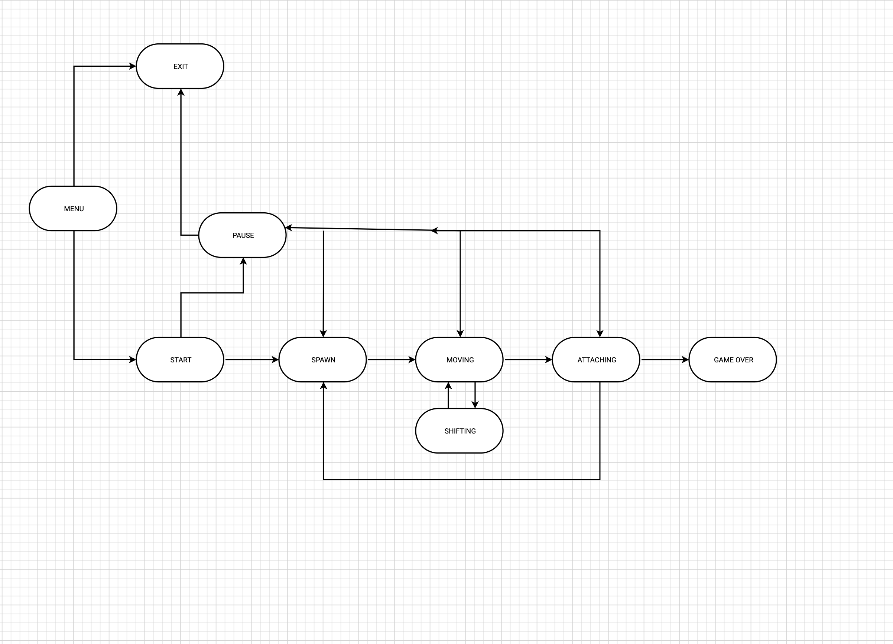
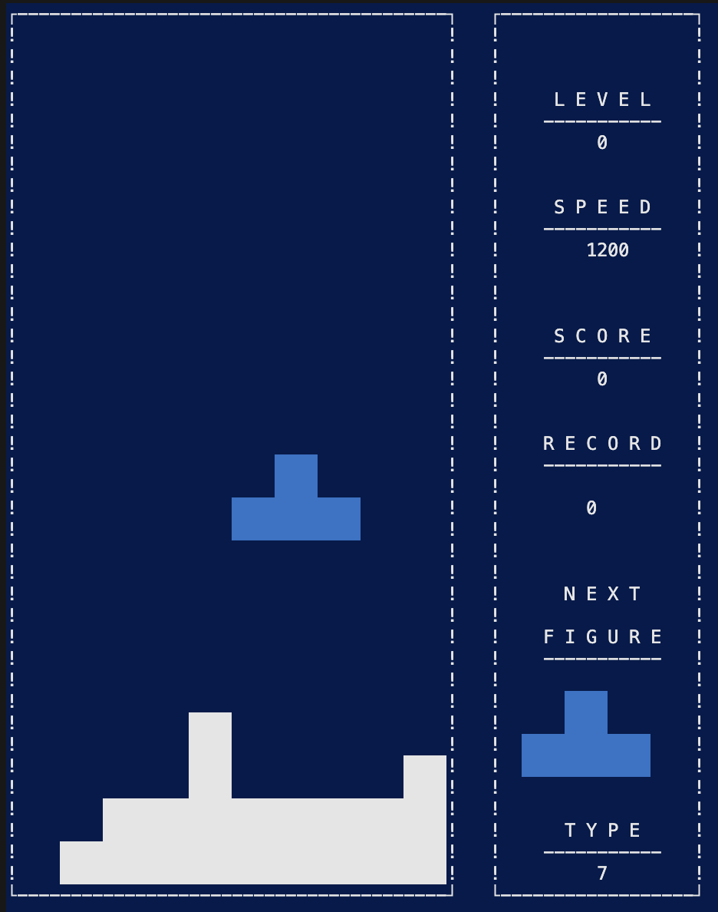
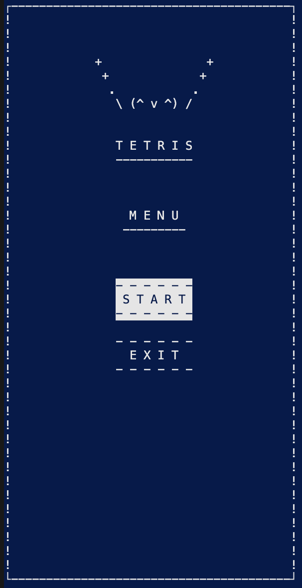
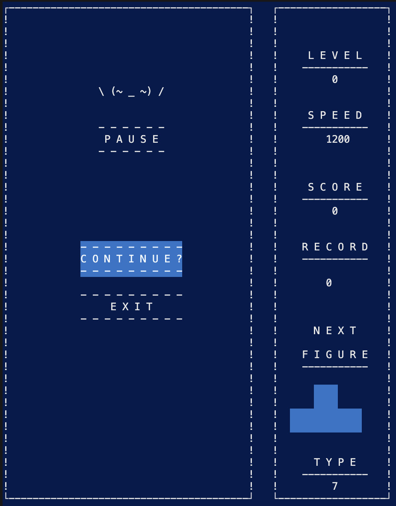
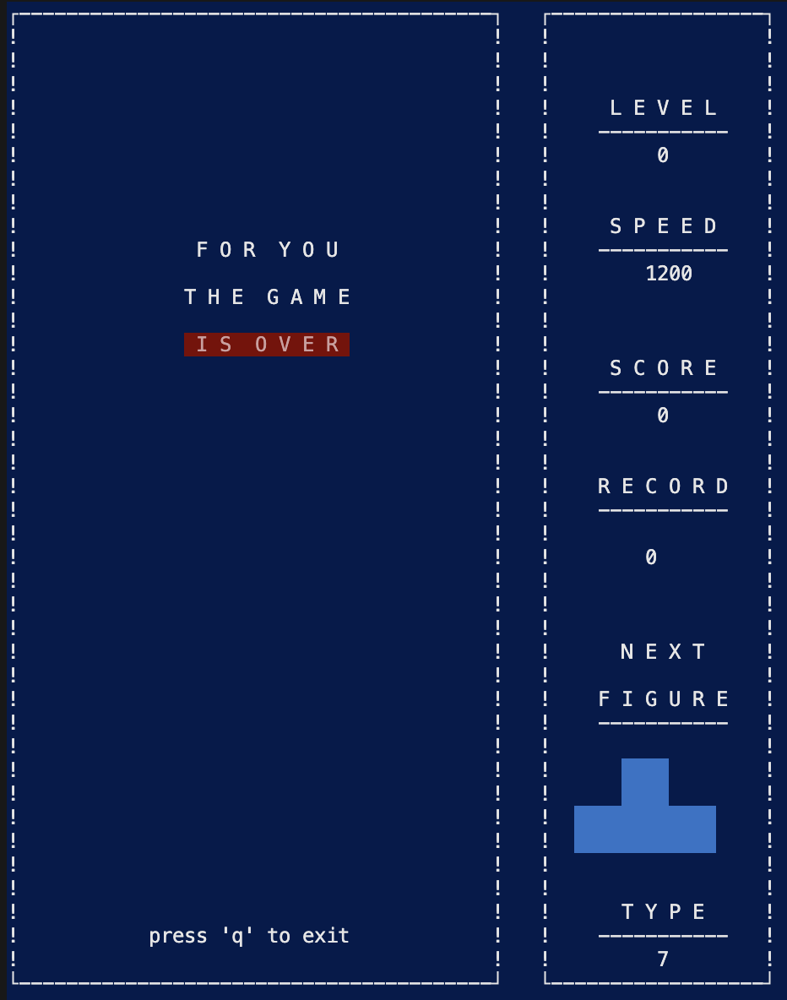

# Тетрис
Реализация игры "Тетрис" в консольной версии на языке программирования С с использованием структурного подхода.

## Содержание
- [Технологии](#технологии)
- [Использование](#использование)
- [Обзор конечного автомата MVP](#обзор-конечного-автомата-mvp)
- [Разработка](#разработка)
- [Способ управления](#способ-управления)
- [Тестирование](#тестирование)

## Технологии
- C
- ncurses
- check.h
- Makefile

## Использование

1. Для установки проекта необходимо склонировать репозиторий `git clone git@github.com:BalagurovaA/C_BrickGame_v1-tetris.git`, перейти в папку `./C_BrickGame_tetris/src`

2. Скомпилировать и запустить проект: 
```sh
make
```
или 

```sh
make all
```
или
```sh
make install
```
При вводе данной команды проект компилируется, запускаются тесты, в терминале запускается игра, открывается html страница, отображающая покрытие тестами.

3. Запуск тестов
```sh
make test
``` 
4. Открыть документацию
```sh
make dvi
``` 
5. Сделать архив, содержащий в себе папку всего проекта вместе с приложением
```sh
make dist
``` 
6. Удалить приложение
```sh
make uninstall
``` 
7. Отображение покрытия тестами через html страницу
```sh
make gcov_report
```
8. Запуск unit-тестов
```sh
make check
```
9. Очистка проекта
```sh
make clean
```

## Обзор конечного автомата MVP

Конечный автомат (КА) в теории алгоритмов — математическая абстракция, модель дискретного устройства, имеющего один вход, один выход и в каждый момент времени находящегося в одном состоянии из множества возможных.

При работе на вход КА последовательно поступают входные воздействия, а на выходе КА формирует выходные сигналы. Переход из одного внутреннего состояния КА в другое может происходить не только от внешнего воздействия, но и самопроизвольно.

Конечный автомат в игре тетрис: 

<br> 

- Старт — состояние, в котором игра ждет, пока игрок нажмет кнопку готовности к игре.
- Спавн — состояние, в которое переходит игра при создании очередного блока и выбора следующего блока для спавна.
- Перемещение — основное игровое состояние с обработкой ввода от пользователя — поворот блоков/перемещение блоков по горизонтали.
- Сдвиг — состояние, в которое переходит игра после истечения таймера. В нем текущий блок перемещается вниз на один уровень.
- Соединение — состояние, в которое преходит игра после «соприкосновения» текущего блока с уже упавшими или с землей. Если образуются заполненные линии, то она уничтожается и остальные блоки смещаются вниз. Если блок остановился в самом верхнем ряду, то игра переходит в состояние «игра окончена».
- Игра окончена — игра окончена.

## Разработка

### Требования
- `gcc`
- `make`
- `gcov/lcov`
- `check.h`
-----------------
- Для реализации игры «Тетрис» проект состоит из двух частей: библиотеки, реализующей логику работы игры, которую можно подключать к различным GUI в будущем, и терминального интерфейса. 
- Логика работы библиотеки реализована с использованием конечный автомат, описанный [выше](#обзор-конечного-автомата-mvp)
- Данная программа разработана на языке Си стандарта С11 с использованием компилятора gcc
- Программа состоит из двух частей: библиотеки, реализующей логику игры тетрис, и терминального интерфейса с использованием библиотеки `ncurses`.
- Для формализации логики игры использован конечный автомат.
- Код библиотеки программы находится в папке `src/brick_game/tetris`.
- Код с интерфейсом программы находится в папке `src/gui/cli`.
- Библиотека имеет функцию, принимающую на вход ввод пользователя, и функцию, выдающую матрицу, которая описывает текущее состояние игрового поля, при каждом ее изменении.
- Сборка программы настроена с помощью Makefile со стандартным набором целей для GNU-программ: all, install, uninstall, clean, dvi, dist, test, gcov_report. 
- Программа разработана в соответствии с принципами структурного программирования.
- Реализация придерживается Google Style

- Игровое поле — десять «пикселей» в ширину и двадцать «пикселей» в высоту.
<br> 

- Фигура, после достижения нижней границы поля или соприкосновения с другой фигурой,останавливается и закрашивается белым. После этого происходит генерация следующей фигуры.

## Способ управления 

1. После запуска открывается меню в котором можно выбрать переход к следующим окнам
- START -> переход к игре
- EXIT  -> выход из игры, нажмите Enter, после этого нажмите 'p'
<br> 

2. После кнопки старт у программы присутствует управление:

- Стрелка вверх : `поворот фигуры`
- Стрелка вниз: `ускорение`
- Стрелка вправо: `движение вправо`
- Стрелка влево: `движение влево`
- Кнопка 'p':  `пауза`
<br> 

3. После нажатия кнопки пауза октывается окно паузы с возможностью продолжить игру и с возможностью выхода из игры. После выхода из игры нужно нажать кнопку Enter и откроется окно final.
<br> 

4. Боковая панель
При старте игры справа возникает боковая панель на которой изображены: уровень, рекорд, скорость, следующая фигура, тип фигуры для возможного мониторинга процесса игры 

5. В игре присутствует начисление очков и установление рекорда.
Начисление очков происходит следующим образом:

- 1 линия — 100 очков;
- 2 линии — 300 очков;
- 3 линии — 700 очков;
- 4 линии — 1500 очков.

6. Управление возможно только при английской раскладке клавиатуры.

## Тестирование
- Присутствует полное покрытие unit-тестами функций библиотеки c помощью библиотеки `Check.h`
- Unit-тесты проверяют результаты работы реализации всей backend-части тетриса, которая релизована в модели
- Unit-тесты покрывают около 90% каждой функции

### Причина разработки данного проекта
Учебное задание в Школе 21 от Сбера