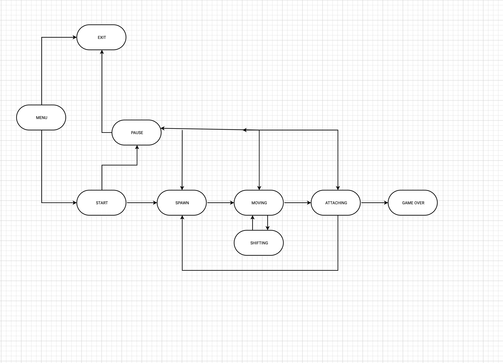
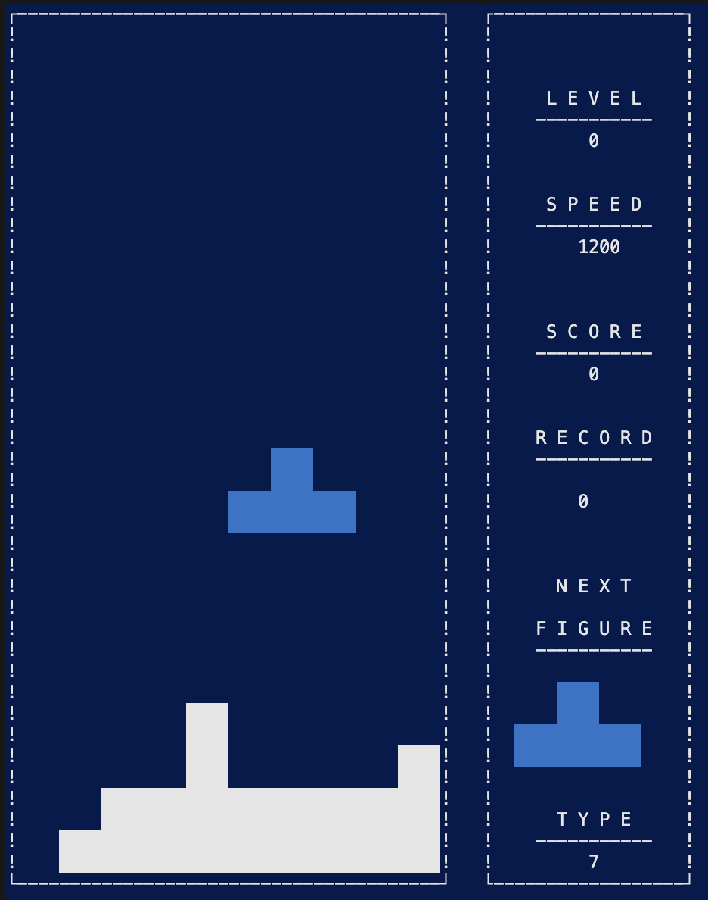
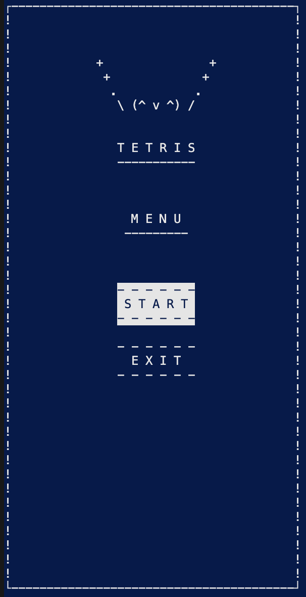
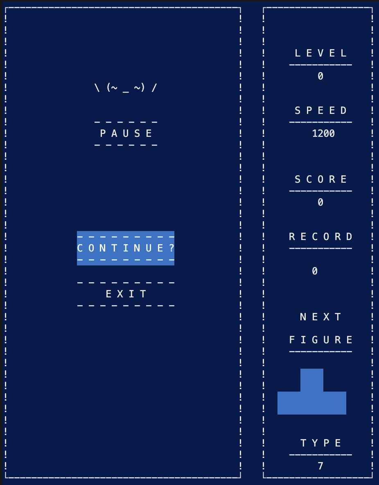

## Тетрис
## Установка и запуск
Для запуска приложения необходимо:
- склонировать репозиторий
- перейти в папку
- выполнить команду make

`git clone git@github.com:BalagurovaA/C_BrickGame_v1-tetris.git`

`./C_BrickGame_v1-tetris/src`

## Part 1
- Данная программа разработана на языке Си стандарта С11 с использованием компилятора gcc
- Для формализации логики игры использован конечный автомат
- Для запуска программы

  

- Программа состоит из двух частей: основная логика(backend) и терминальный интерфейс с использованием библиотеки ncurses
- Сборка программы настроена с помощью Makefile со стандартным набором целей для GNU-программ: all, install, uninstall, clean, dvi, dist, test, gcov_report.

- Игровое поле — десять «пикселей» в ширину и двадцать «пикселей» в высоту.
  

- Фигура, после достижения нижней границы поля или соприкосновения с другой фигурой,останавливается и закрашивается белым. После этого происходит генерация следующей фигуры.

## Part 2 Способ управления 

1. После запуска открывается меню в котором можно выбрать переход к следующим окнам
- START -> переход к игре
- EXIT  -> выход из игры, нажмите Enter, после этого нажмите 'p'
  

2. После кнопки старт у программы присутствует управление:

- Стрелка вверх : `поворот фигуры`
- Стрелка вниз: `ускорение`
- Стрелка вправо: `движение вправо`
- Стрелка влево: `движение влево`
- Кнопка 'p':  `пауза`
  

3. После нажатия кнопки пауза октывается окно паузы с возможностью продолжить игру и с возможностью выхода из игры. После выхода из игры нужно нажать кнопку Enter и откроется окно final.
  

4. Боковая панель
При старте игры справа возникает боковая панель на которой изображены: уровень, рекорд, скорость, следующая фигура, тип фигуры для возможного мониторинга процесса игры 

5. В игре присутствует начисление очков и установление рекорда.
Начисление очков происходит следующим образом:

- 1 линия — 100 очков;
- 2 линии — 300 очков;
- 3 линии — 700 очков;
- 4 линии — 1500 очков.

6. Управление возможно только при английской раскладке клавиатуры.

Удачи в игре!
